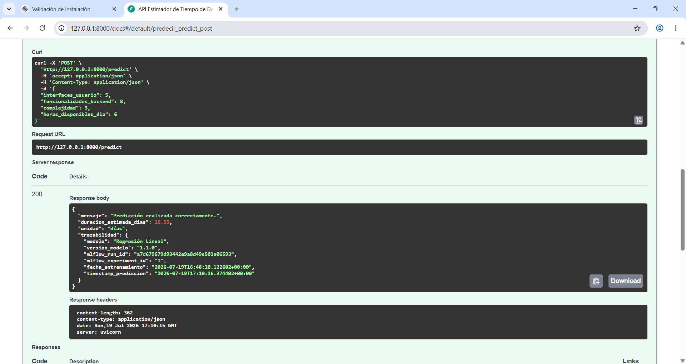
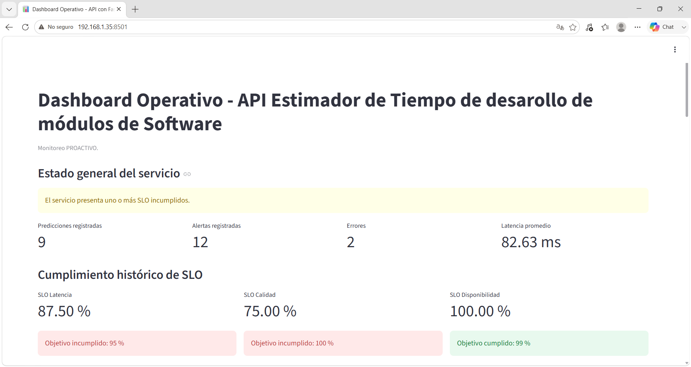
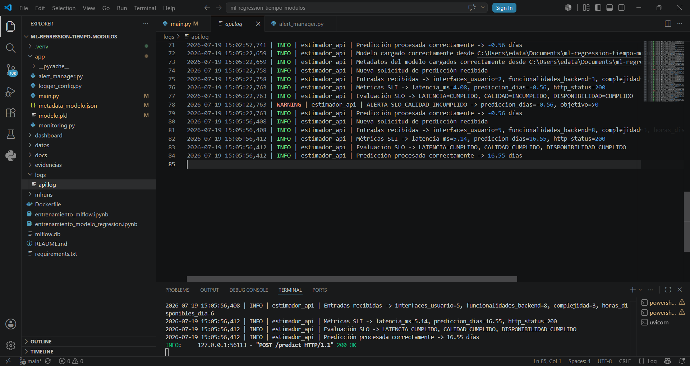

# Predicción del Tiempo de Desarrollo de Módulos de Software mediante Machine Learning

## Descripción

Este proyecto implementa una solución de Machine Learning para estimar el tiempo necesario para desarrollar módulos de software. El modelo fue entrenado utilizando un conjunto de datos sintético y una técnica de **Regresión Lineal**, permitiendo realizar predicciones a partir de características del módulo de software.

Como segunda fase del proyecto, se incorporó un sistema de monitoreo proactivo para supervisar el comportamiento del modelo y de la API en producción. La solución incluye indicadores de nivel de servicio (SLI), objetivos de nivel de servicio (SLO), alertas inteligentes, simulación de incidentes y un dashboard operativo desarrollado con Streamlit.

La aplicación se expone mediante una API REST desarrollada con **FastAPI** y se encuentra preparada para su ejecución en contenedores mediante **Docker**.

---

# Objetivos del proyecto

- Estimar el tiempo de desarrollo de módulos de software utilizando Machine Learning y la técnica de regresión lineal.
- Exponer el modelo mediante una API REST con FastAPI.
- Implementar monitoreo proactivo basado en SLI y SLO.
- Generar alertas inteligentes ante incumplimientos del servicio.
- Simular incidentes para validar el sistema de monitoreo.
- Visualizar métricas y alertas mediante un dashboard operativo.

---

# Tecnologías utilizadas

- Python 3.13
- Scikit-learn
- Pandas
- NumPy
- FastAPI
- Uvicorn
- Streamlit
- Docker
- Git y GitHub

---

# Variables utilizadas por el modelo

El modelo utiliza las siguientes variables de entrada:

| Variable | Descripción |
|----------|-------------|
| Interfaces de usuario | Número de interfaces del módulo |
| Funcionalidades backend | Número de funcionalidades backend |
| Complejidad | Nivel de complejidad (1–5) |
| Horas disponibles por día | Horas de trabajo disponibles (4–8) |

Salida del modelo:

- Días estimados para desarrollar el módulo.

---

# Modelo de Machine Learning

Se utilizó un modelo de **Regresión Lineal** entrenado con un conjunto de datos sintético.

### Métricas obtenidas

| Métrica | Resultado |
|----------|----------:|
| MAE | 2.39 días |
| RMSE | 3.15 días |
| R² | 0.9323 |

---

# Arquitectura de la solución

```text
Cliente
    │
    ▼
FastAPI
    │
    ▼
Modelo de Machine Learning
    │
    ▼
Logging
    │
    ▼
Evaluación SLI
    │
    ▼
Evaluación SLO
    │
    ▼
Alertas Inteligentes
    │
    ▼
Dashboard Streamlit
```

---

# Monitoreo Proactivo

El sistema implementa un esquema de observabilidad moderno para supervisar continuamente el estado del servicio.

## Métricas (SLI)

- Latencia de respuesta.
- Disponibilidad del servicio.
- Calidad de las predicciones.
- Total de predicciones.
- Total de alertas.
- Total de errores.

## Objetivos de Nivel de Servicio (SLO)

| Indicador | Objetivo |
|-----------|----------|
| Latencia | 95 % de las solicitudes menores a 500 ms |
| Disponibilidad | 99 % de respuestas HTTP 200 |
| Calidad | 100 % de predicciones válidas |

---

# Alertas inteligentes

El sistema genera automáticamente alertas cuando se incumple algún SLO.

Alertas implementadas:

- SLO_LATENCIA_INCUMPLIDO
- SLO_DISPONIBILIDAD_INCUMPLIDO
- SLO_CALIDAD_INCUMPLIDO

Estas alertas quedan registradas en los logs y son visualizadas automaticamente en el dashboard.

---

# Simulación de incidentes

Para validar el sistema de monitoreo se implementaron mecanismos dos casos de simulación de incidentes.

## Simulación de latencia

Incrementa artificialmente el tiempo de respuesta para provocar el incumplimiento del SLO de latencia.

```json
{
  "simular_latencia": true
}
```

## Simulación de error

Genera un error interno para validar el monitoreo de disponibilidad.

```json
{
  "simular_error": true
}
```

---

# Dashboard Operativo

El dashboard fue desarrollado con **Streamlit** y cuenta con la siguiente estructura:

- Estado del servicio.
- Total de predicciones.
- Total de alertas.
- Total de errores.
- Latencia promedio.
- Cumplimiento histórico de SLO.
- Historial de alertas.
- Gráficas de latencia.
- Gráficas de predicciones.

---

# Estructura del proyecto

```text
├── app/
│   ├── main.py
│   ├── monitoring.py
│   ├── alert_manager.py
│   ├── logger_config.py
│   ├── metadata_modelo.json
│   └── modelo.pkl
│
├── dashboard/
│   ├── app.py
│   ├── parser_logs.py
│
├── datos/
│   └── dataset_sintetico.csv
│
├── docs/
│   └── DOCUMENTACION_MONITOREO_PROACTIVO.docx
    └── Manual_Despliegue_Nube.md
    └── Validacion_Pruebas.md

│
├── logs/
│   └── api.log
│
├── evidencias/
├── mlruns/


├── Dockerfile
├── entrenamiento_mlflow.ipynb
├── entrenamiento_modelo_regresion.ipynb
├── Dockerfile
├── requirements.txt
└── README.md
```

---

# Instalación

Clonar el repositorio:

```bash
git clone https://github.com/elidatac/ml-regression-tiempo-modulos
```

Entrar al proyecto:

```bash
cd ml-regression-tiempo-modulos
```

Instalar dependencias:

```bash
pip install -r requirements.txt
```

---

# Ejecución de la API

```bash
uvicorn app.main:app --reload
```

Documentación Swagger:

```
http://127.0.0.1:8000/docs
```

---

# Ejecución del Dashboard

```bash
streamlit run dashboard/app.py
```

---

# Docker

Construir la imagen:

```bash
docker build -t monitoreo-ml .
```

Ejecutar el contenedor:

```bash
docker run -p 8000:8000 monitoreo-ml
```

---

# Evidencias

## API REST


```markdown

```

---

## Dashboard Operativo


```markdown

```

---

## Historial de alertas


```markdown

```

---

# Documentación

La documentación técnica del proyecto se encuentra disponible en la carpeta:

```text
docs/
```

Incluye:

- Documento técnico de monitoreo proactivo.
- Indicadores.
- Alertas inteligentes.
- Dashboard operativo.
- Runbooks.
- Estrategias de detección de data drift.
- Documentación de respuesta automatizada.

---

# Repositorio

Este repositorio constituye la evidencia del desarrollo e implementación del proyecto, incluyendo el modelo de Machine Learning, la API, el sistema de monitoreo proactivo, las alertas inteligentes, la simulación de incidentes y el dashboard operativo.

---

# Autor

**Carmen Elizabeth Juárez**

Proyecto académico desarrollado como evidencia de la implementación de un sistema de Machine Learning con monitoreo proactivo, observabilidad y operación de modelos en producción.