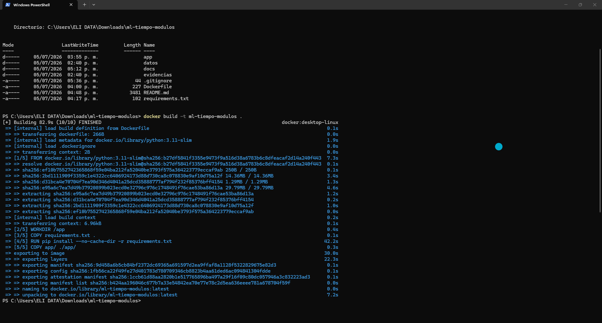
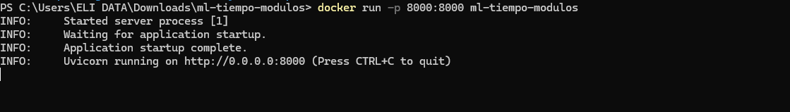
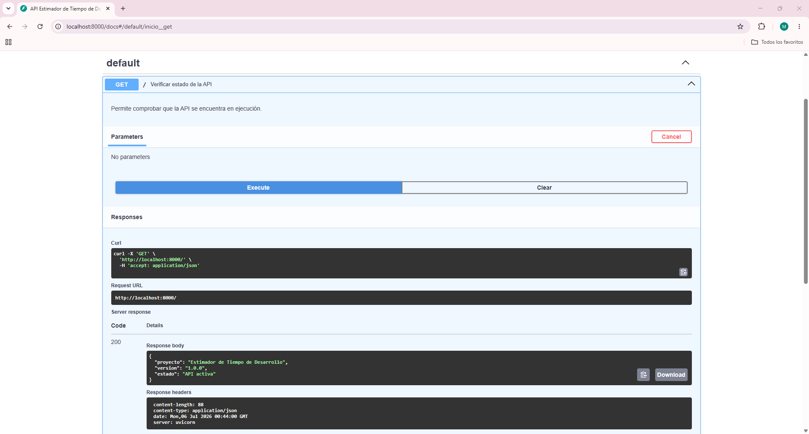
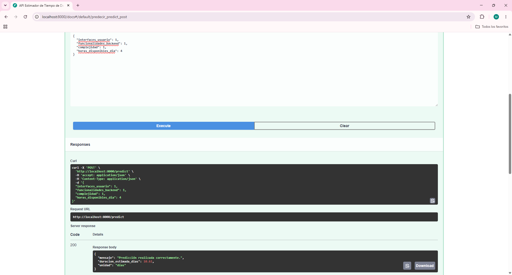
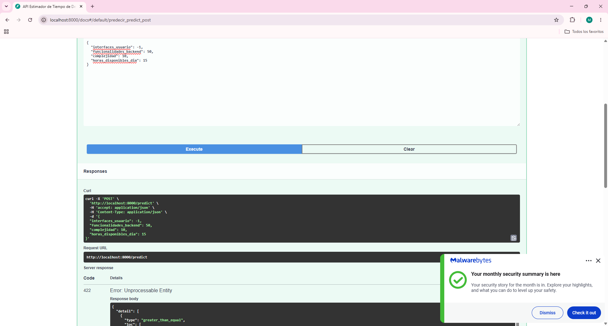

# Documento de Validación y Pruebas

## 1. Objetivo

El presente documento describe las pruebas funcionales realizadas para validar el correcto funcionamiento de la aplicación de machine learning desarrollada.
Las pruebas consideran la construcción de la imagen Docker, la ejecución del contenedor y la verificación del funcionamiento de la API mediante sus dos endpoints.

---

## 2. Ambiente de pruebas

| Componente | Descripción |
|------------|-------------|
| Sistema Operativo | Windows 11 |
| Lenguaje | Python 3.11 |
| Framework API | FastAPI |
| Contenedores | Docker Desktop |
| Modelo ML | Regresión Lineal |
| Puerto utilizado | 8000 |

---

# 3. Pruebas funcionales

## Prueba 1. Construcción de la imagen Docker

**Objetivo**

Verificar que la imagen Docker se construye correctamente utilizando el Dockerfile del proyecto.

**Comando**

```bash
docker build -t ml-tiempo-modulos .
```

**Evidencia**


**Figura 1. Construcción de la imagen Docker.**

---

## Prueba 2. Ejecución del contenedor

**Objetivo**

Comprobar que el contenedor inicia correctamente y publica el servicio en el puerto 8000.

**Comando**

```bash
docker run -p 8000:8000 ml-tiempo-modulos
```

**Evidencia**


**Figura 2. Contenedor Docker en ejecución.**

---

## Prueba 3. Endpoint GET /

**Objetivo**

Verificar que la API responde correctamente.

**Método**

GET /

**Evidencia**


**Figura 3. Endpoint GET /.**

---

## Prueba 4. Endpoint POST /predict

**Objetivo**

Comprobar que el modelo realiza una predicción correctamente.

**Método**

POST /predict

**Datos de prueba**

```json
{
    "interfaces_usuario": 6,
    "funcionalidades_backend": 12,
    "complejidad": 4,
    "horas_disponibles_dia": 8
}
```

**Evidencia**


**Figura 4. Predicción del modelo.**

---

# 4. Pruebas de Casos Extremos  (edge cases)

## Caso 1. Valores mínimos permitidos

```json
{
    "interfaces_usuario": 1,
    "funcionalidades_backend": 1,
    "complejidad": 1,
    "horas_disponibles_dia": 4
}
```

**Resultado esperado**

La API genera una predicción válida.

**Evidencia**


**Figura 5. Caso mínimo.**

---

## Caso 2. Valores máximos permitidos

```json
{
    "interfaces_usuario": 15,
    "funcionalidades_backend": 20,
    "complejidad": 5,
    "horas_disponibles_dia": 8
}
```

**Resultado esperado**

La API genera una predicción válida.

**Evidencia**


**Figura 6. Caso máximo.**

---

## Caso 3. Datos fuera del rango permitido

```json
{
    "interfaces_usuario": -1,
    "funcionalidades_backend": 50,
    "complejidad": 10,
    "horas_disponibles_dia": 15
}
```

**Resultado esperado**

La API rechaza la solicitud mostrando un error de validación HTTP 422.

**Evidencia**


**Figura 7. Error de validación HTTP 422.**

---

# 5. Conclusiones

Las pruebas funcionales y los casos extremos permitieron verificar tanto el comportamiento esperado de la aplicación como el manejo adecuado de entradas inválidas, demostrando que la solución puede ejecutarse de forma consistente en un entorno local mediante Docker.
